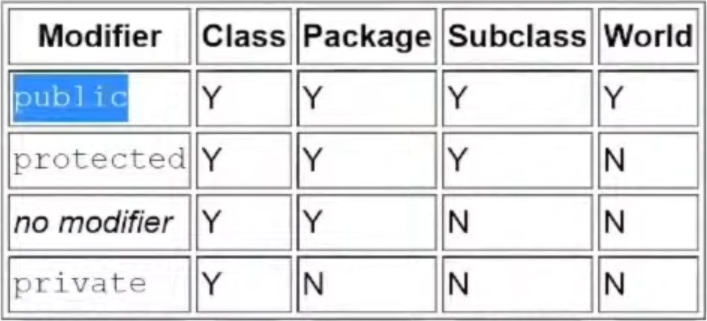

# Java Notes

## Noteworthy Points

* If a variable is left uninitialized then java initializes it with a default value
  * for int it's 0.

* If no constructor is defined by programmer then java provides a default constructor.

## Data types

### Primitive Data types

* byte : 1 byte long.
* short : 2 byte.
* int : 4 byte.
* long : 8 byte.
* float : 4 byte. *ends with f*
* double : 8 byte. *ends with d*
* boolean : 1 bit. **REALLY**
* char : 2 byte. *stores unicode*

### Non Primitive Data types

* Array : Contiguous sequence of data. **Homogenous data structure**.

    ```java
    int arr[] = new int[2];

* String : Character array. *(special data type primitive and non primitive)*
* Classes : User defined.  

## Tokens

>Reserved expressions or words or symbols which have a predefined meaning in the programming language. **cannot be redefined**

* Keywords : Reserved words, eg : boolean, byte, class.
* Identifiers : Variable names declared by the programmer. *(Standard cpp naming rules apply)*
* Constants : Immutable variables.
  
    ```java
    final int i = 5;

* Special symbols : [] , () {} ; * =
* Operators
  * Arithmetic
  * Bitwise
  * Logical
  * Comparison
  
## Data Type Conversions

* Implicit Type Conversion : Smaller size data types are implicitly converted to larger sized variable.
* Explicit Data Type Conversion : If larger sized data type is to be converted in smaller size variable, then it needs to be done explicitly by the programmer and some data would also be lost depending on the conversion.
  
    ```java

    double a = 50.5089898564;
    System.out.println("Double " + a);

    float b = (float)a;
    System.out.println("Float : " + b);

    int c = (int)a;
    System.out.println("Int : " + c);

    ```

    ```shell

    output : Double 50.5089898564
             Float : 50.50899
             Int : 50
    ```

## First Java Program

```java
package test.package1;

public class TestHelloWorld {
 
    public static void main(String commandLineArguments[]) {
        System.out.println("Hello, World");
    } 
}

```

* package : Something that can group multiple related artifacts together. **First line of a java program**  
* public : **Access specifier** Allows the class to be accessible to every other file of this project.
* class : class keyword.
* class name *(TestHelloWorld)* here : This public class name must match with the file name.
* main method : For executing any class in java a main method is needed. It is the entry method of java.
  * public : main method has to be public because **java runtime** has to be able to access this method.
  * static : to be able to run this class without creating an object of this class.
  * void : return type *only void accepted*  
  * main : function name.
  * String arg[] : command line arguments.
* System : Class containing methods for standard i/o & errors.
* out : stream for printing the standard output.
* println : prints a string and terminates the line;
* System.out.println : system class uses the output stream to print something on the consol using the println method.

## Arrays

>Contiguous memory locations of any specific data type.

### One Dimension Array

```java
int[] anArray;
anArray = new int[10];
```

### Two Dimension Array

```java
int arr1[][] = {{2, 7, 9}, {3, 6, 1}, {7, 4, 2}};
int[][] arr2 = {{2, 7, 9}, {3, 6, 1}, {7, 4, 2}};
```

* {{}, {}, {}} : This structure is necessary.

## Operators

* Arithmetic
  * '+' : Addition/Concatenation.
  * '-' : Subtraction.
  * '*' : Multiplication.
  * '/' : Division.
  * '%' : Modulus.  
* Unary
  * '+'  : Turns integer positive. *Positive by default*
  * '-'  : Turns integer negative.
  * '++' : Increment. *Postfix and Prefix apply*
  * '--' : Decrement. *Postfix and Prefix apply*
  * '!'  : Logical Negation.  
* Bitwise
  * '&'   : and **Not Short Circuit**
  * '|'   : or
  * '>>'  : Signed right shift.
  * '<<'  : Signed left shift.
  * '>>>' : Unsigned right shift.
  * '<<<' : Unsigned left shift.
  * '~'   : Negation.
* Logical
  * '&&' / 'AND' : Logical and **Short Circuit**.
  * '||' / 'OR'  : Logical or **Short Circuit**.
* Comparison/ Relational
  * '==' : equal to
  * '!=' : not equal to
  * '>'  : greater than
  * '>=' : greater than or equal to
  * '<'  : less than
  * '<=' : less than or equal to
* Ternary Operator  
 *(condition) ***?*** (execute if true) ***:*** (execute if false)*  

```java
Max = (a > b) ? (a) : (b);
```

## Control Flow

* If else

```java
if (testScore >= 90){
    grade = 'A';
}
else if (testScore >= 80){
    grade = 'B';
}
else if (testScore >= 70){
    grade = 'C';
}
else if (testScore >= 60){
    grade = 'D';
}
else {
    grade = 'F';
}
```

*Same goes for nested if.*

* Do While Loop

```java
do {
    Statements
} while (Expression);
```

* While Loop

```java
while (Expression) {
    statement.
}
```

* For Loop

```java
for (initialization; termination; increment/decrement){
    statements
}
```

* Enhanced for loop  
  *Used for iterating over a collection*

```java
int[] collection = {1,2,3};
for(int item : collection) {
    system.out.print("item" + item);
}

int[][] arr = {{2, 7, 9}, {3, 6, 1}, {7, 4, 2}};
    for(int i[] : arr) {
        for(int j : i)
            System.out.print(j + " ");
        System.out.println();
    }
```

## Java Collections

* Class
  * Array List : Dynamic Array, supports indexing.
  * Linked List : linear access.
  * Set : unique elements.  
  * Stack
  * Priority Queue
  * Vector : Same like Array List but Thread safe.

## List interface

>Dynamic size, stored according to the order in which elements are inserted.

* ArrayList

  * Derived form list.

    ```java
    List<Integer> arrayList; //Base Class name (not necessary)
    arrayList = new ArrayList<Integer>(5); // Actual Class name
    ```

* LinkedList
  * Derived from list.

    ```java
    List<String> list;
    list = new LinkedList<String>(); //size taken by default.
    ```

## Set interface

>Unique elements, unordered storage.

* HashSet
  * Derived form Set.
  * Random Storage.

  ```java
   
  Set<String> hashSet;
  hashSet = new HashSet<String>(5);
  ```

  * All the duplicates are rejected. *Only the first element is inserted*

* TreeSet
  * Derived form Set.
  * Used when natural order/hierarchy of elements needs to be maintained.
  * Elements are stored in the natural order of sequence of their data type *(for eg. in String a will come before c)*, **irrespective of the order in which they were inserted**.

  ```java
   
  Set<String> treeSet;
  treeSet = new TreeSet<String>(5);
  ```

## Map  

* Key value pair storage.
* Isn't iterable coz isn't derived form iterable class of java.
* Keys will be unique, values can be duplicate.
* Uses **Set** class to store keys.
* Uses **List** class to store values.
  
### Classes of Map

* TreeMap : Elements(Key value pair) are stored in the natural sorting order of keys.  
  
  * ```java
    TreeMap<Integer, String> treeMap;
    treeMap = new TreeMap<>();
    ```

* HashMap : Random Storage of elements.

  * ```java
    Map<String, Integer> map;
    map = new HashMap<String, Integer>();
    ```

  * Util function :
    * map.put(key, value);
    * map.size();
    * map.containsKey(key);
    * map.keySet(); *returns iterable object containing all the keys*.
    * map.entrySet(); *returns iterable object containing all the key, value pair entries of the set*.
  
* LinkedHashMap : Derives from HashMap, elements are stored in the order of their insertion.
* HashTable : Thread safe implementation of hashMap.

## Stack and Queue

* Stack
  * LIFO.

    ```java
    Stack<String> stack;
    stack = new Stack<>();
    ```

* PriorityQueue
  * FIFO.
  * Elements sorted according to their natural order.
  * System.out doesn't show the natural sorting order.

## Streams

>Concept similar to streaming Netflix rather than Downloading videos, more efficient in using multicore capability of processors.

* Using stream to create a list containing squares of element of other list.

  * sqSet contains set of squares of list.
  * sqList contains list of  squares of list.

```java
  Set<Integer> sqSet = list.stream().map(x -> x*x/100).collect(Collectors.toSet());
  List<Integer> sqList = list.stream().map(x -> x*x/100).collect(Collectors.toList());
```

* filter() : Used whenever a conditional logic or filtering is done on a stream.  
  * Condition can be any if condition.
  * Once the filter method has completed it's execution after that only the methods which  have satisfied the condition will be left in the stream.  
  
  ```java
    List<String> filteredResult = languages.stream().filter(s -> s.startsWith("p")).collect(Collectors.toList());  
  ```  

* sorted() : Sorts a collection.
  
  ```java
   List<String> SortedList = 
   languages.stream().sorted().collect(Collectors.toList());
   System.out.println(SortedList);
  ```

* forEach() : Iterate over all the elements of the Collection.
  
  ```java
    languages.stream().forEach(elem -> {
      System.out.println(elem);
    });
  ```

* reduce() : Whenever the complete collection representation is to be converted to a single result then reduced() method is used.  
  * Identity : An element that is the initial value of reduction operation and the default result if the stream is empty. *0 here*
  * Accumulator : a function that takes two parameters :
    * a partial result of the reduction operation.
    * and the next element of hte stream.
    * also the definition of function using lambda functions.
  * Combiner : A function used to combine the partial result of hte reduction operation when the reduction is parallelized, or when there's a mismatch between the types of the accumulator. **NOT USED HERE**.

  ```java
  int sum = numList.stream.reduce(0, (prevSum, nextElement) -> prevSum + nextElement);
  ```

## Classes and objects

* Everything is exactly similar to cpp except for these two points.
  * object creation is via **new** keyword.

   ```java
   className objectName = new className(constructorArguments);
  ```

  * accessSpecifier is needed for every method individually.
  
### Access Modifiers



### Inheritance

> Java doesn't support multiple inheritance.

* **Syntax**

```java
accessSpecifier class derivedClass extends baseClass {
  accessSpecifier derivedClass(parametersDerivedClass+parametersBaseClass){
    super(parametersBaseClass) //invokes the base class constructor.

  }
}
```

* extends : Keyword used to derive class form base class.
* super : Invokes the base class constructor with the supplied arguments. **Must be the first line of derived class constructor**
* When an object of child class is declared, then java automatically calls the constructor of the child class as well as that of the **Parent Class**. even if it isn't called by the programmer explicitly *Using super*.

### Abstraction

> Hiding details of implementation.

* Abstract class can't be instantiated, but they can be subclassed.
* An abstract class must have atleast one abstract method.
* Abstract class can also have concrete methods.
* Abstract methods are declared without an implementation, it is the responsibility of child class which inherits the abstract method to define it.
* The child class must provide definition of all the inherited abstract methods.

```java
abstract void moveTo(double deltaX, double deltaY);
```

**Check codes for clarification**
 