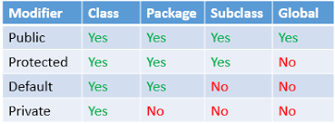

# Java Notes

- [Java Notes](#java-notes)
  - [Noteworthy Points](#noteworthy-points)
  - [Data types](#data-types)
    - [Primitive Data types](#primitive-data-types)
    - [Non Primitive Data types](#non-primitive-data-types)
  - [Tokens](#tokens)
  - [Data Type Conversions](#data-type-conversions)
  - [First Java Program](#first-java-program)
  - [Arrays](#arrays)
    - [One Dimension Array](#one-dimension-array)
    - [Two Dimension Array](#two-dimension-array)
  - [Operators](#operators)
  - [Control Flow](#control-flow)
  - [Java Collections](#java-collections)
  - [List interface](#list-interface)
  - [Set interface](#set-interface)
  - [Map](#map)
    - [Classes of Map](#classes-of-map)
  - [Stack and Queue](#stack-and-queue)
  - [Streams](#streams)
  - [Classes and objects](#classes-and-objects)
    - [Access Modifiers](#access-modifiers)
  - [Inheritance](#inheritance)
  - [Abstraction](#abstraction)
  - [Interface](#interface)
  - [Multiple inheritance using interfaces](#multiple-inheritance-using-interfaces)
  - [Polymorphism](#polymorphism)
    - [Method Overloading](#method-overloading)
    - [Method Overriding](#method-overriding)
  - [Static Members](#static-members)
  - [Nested Class](#nested-class)
    - [Static Nested Classes](#static-nested-classes)
    - [Non Static Nested Classes](#non-static-nested-classes)
    - [Anonymous Inner Classes](#anonymous-inner-classes)
  - [Packages](#packages)
  - [Methods](#methods)
  - [Exceptions in Java](#exceptions-in-java)
    - [Custom Exceptions](#custom-exceptions)
    - [Exception Handling](#exception-handling)
  - [Object Class](#object-class)
    - [equals() and hashCode()](#equals-and-hashcode)
  - [Comparable Interface](#comparable-interface)
    - [Comparator interface](#comparator-interface)
  
## Noteworthy Points

* If a variable is left uninitialized then java initializes it with a default value
  * for int it's 0.

* If no constructor is defined by programmer then java provides a default constructor.
* Dynamic Object Binding : if reference is of abstract class/ interface and object is of derived class.

```java
List<Integer> listObj = new ArrayList<>();
```

## Data types

### Primitive Data types

* byte : 1 byte long.
* short : 2 byte.
* int : 4 byte.
* long : 8 byte.
* float : 4 byte. *ends with f*
* double : 8 byte. *ends with d*
* boolean : 1 bit. **REALLY**
* char : 2 byte. *stores unicode*

### Non Primitive Data types

* Array : Contiguous sequence of data. **Homogenous data structure**.

    ```java
    int arr[] = new int[2];

* String : Character array. *(special data type primitive and non primitive)*
* Classes : User defined.  

## Tokens

>Reserved expressions or words or symbols which have a predefined meaning in the programming language. **cannot be redefined**

* Keywords : Reserved words, eg : boolean, byte, class.
* Identifiers : Variable names declared by the programmer. *(Standard cpp naming rules apply)*
* Constants : Immutable variables.
  
    ```java
    final int i = 5;

* Special symbols : [] , () {} ; * =
* Operators
  * Arithmetic
  * Bitwise
  * Logical
  * Comparison
  
## Data Type Conversions

* Implicit Type Conversion : Smaller size data types are implicitly converted to larger sized variable.
* Explicit Data Type Conversion : If larger sized data type is to be converted in smaller size variable, then it needs to be done explicitly by the programmer and some data would also be lost depending on the conversion.
  
    ```java

    double a = 50.5089898564;
    System.out.println("Double " + a);

    float b = (float)a;
    System.out.println("Float : " + b);

    int c = (int)a;
    System.out.println("Int : " + c);

    ```

    ```shell

    output : Double 50.5089898564
             Float : 50.50899
             Int : 50
    ```

## First Java Program

```java
package test.package1;

public class TestHelloWorld {
 
    public static void main(String commandLineArguments[]) {
        System.out.println("Hello, World");
    } 
}

```

* package : Something that can group multiple related artifacts together. **First line of a java program**  
* public : **Access specifier** Allows the class to be accessible to every other file of this project.
* class : class keyword.
* class name *(TestHelloWorld)* here : This public class name must match with the file name.
* main method : For executing any class in java a main method is needed. It is the entry method of java.
  * public : main method has to be public because **java runtime** has to be able to access this method.
  * static : to be able to run this class without creating an object of this class.
  * void : return type *only void accepted*  
  * main : function name.
  * String arg[] : command line arguments.
* System : Class containing methods for standard i/o & errors.
* out : stream for printing the standard output.
* println : prints a string and terminates the line;
* System.out.println : system class uses the output stream to print something on the consol using the println method.

## Arrays

>Contiguous memory locations of any specific data type.

### One Dimension Array

```java
int[] anArray;
anArray = new int[10];
```

### Two Dimension Array

```java
int arr1[][] = {{2, 7, 9}, {3, 6, 1}, {7, 4, 2}};
int[][] arr2 = {{2, 7, 9}, {3, 6, 1}, {7, 4, 2}};
```

* {{}, {}, {}} : This structure is necessary.

## Operators

* Arithmetic
  * '+' : Addition/Concatenation.
  * '-' : Subtraction.
  * '*' : Multiplication.
  * '/' : Division.
  * '%' : Modulus.  
* Unary
  * '+'  : Turns integer positive. *Positive by default*
  * '-'  : Turns integer negative.
  * '++' : Increment. *Postfix and Prefix apply*
  * '--' : Decrement. *Postfix and Prefix apply*
  * '!'  : Logical Negation.  
* Bitwise
  * '&'   : and **Not Short Circuit**
  * '|'   : or
  * '>>'  : Signed right shift.
  * '<<'  : Signed left shift.
  * '>>>' : Unsigned right shift.
  * '<<<' : Unsigned left shift.
  * '~'   : Negation.
* Logical
  * '&&' / 'AND' : Logical and **Short Circuit**.
  * '||' / 'OR'  : Logical or **Short Circuit**.
* Comparison/ Relational
  * '==' : equal to
  * '!=' : not equal to
  * '>'  : greater than
  * '>=' : greater than or equal to
  * '<'  : less than
  * '<=' : less than or equal to
* Ternary Operator  
 *(condition) ***?*** (execute if true) ***:*** (execute if false)*  

```java
Max = (a > b) ? (a) : (b);
```

## Control Flow

* If else

```java
if (testScore >= 90){
    grade = 'A';
}
else if (testScore >= 80){
    grade = 'B';
}
else if (testScore >= 70){
    grade = 'C';
}
else if (testScore >= 60){
    grade = 'D';
}
else {
    grade = 'F';
}
```

*Same goes for nested if.*

* Do While Loop

```java
do {
    Statements
} while (Expression);
```

* While Loop

```java
while (Expression) {
    statement.
}
```

* For Loop

```java
for (initialization; termination; increment/decrement){
    statements
}
```

* Enhanced for loop  
  *Used for iterating over a collection*

```java
int[] collection = {1,2,3};
for(int item : collection) {
    system.out.print("item" + item);
}

int[][] arr = {{2, 7, 9}, {3, 6, 1}, {7, 4, 2}};
    for(int i[] : arr) {
        for(int j : i)
            System.out.print(j + " ");
        System.out.println();
    }
```

## Java Collections

* Class
  * Array List : Dynamic Array, supports indexing.
  * Linked List : linear access.
  * Set : unique elements.  
  * Stack
  * Priority Queue
  * Vector : Same like Array List but Thread safe.

## List interface

>Dynamic size, stored according to the order in which elements are inserted.

* ArrayList

  * Derived form list.

    ```java
    List<Integer> arrayList; //Base Class name (not necessary)
    arrayList = new ArrayList<Integer>(5); // Actual Class name
    ```

* LinkedList
  * Derived from list.

    ```java
    List<String> list;
    list = new LinkedList<String>(); //size taken by default.
    ```

## Set interface

>Unique elements, unordered storage.

* HashSet
  * Derived form Set.
  * Random Storage.

  ```java
   
  Set<String> hashSet;
  hashSet = new HashSet<String>(5);
  ```

  * All the duplicates are rejected. *Only the first element is inserted*

* TreeSet
  * Derived form Set.
  * Used when natural order/hierarchy of elements needs to be maintained.
  * Elements are stored in the natural order of sequence of their data type *(for eg. in String a will come before c)*, **irrespective of the order in which they were inserted**.

  ```java
   
  Set<String> treeSet;
  treeSet = new TreeSet<String>(5);
  ```

## Map  

* Key value pair storage.
* Isn't iterable coz isn't derived form iterable class of java.
* Keys will be unique, values can be duplicate.
* Uses **Set** class to store keys.
* Uses **List** class to store values.
  
### Classes of Map

* TreeMap : Elements(Key value pair) are stored in the natural sorting order of keys.  
  
  * ```java
    TreeMap<Integer, String> treeMap;
    treeMap = new TreeMap<>();
    ```

* HashMap : Random Storage of elements.

  * ```java
    Map<String, Integer> map;
    map = new HashMap<String, Integer>();
    ```

  * Util function :
    * map.put(key, value);
    * map.size();
    * map.containsKey(key);
    * map.keySet(); *returns iterable object containing all the keys*.
    * map.entrySet(); *returns iterable object containing all the key, value pair entries of the set*.
  
* LinkedHashMap : Derives from HashMap, elements are stored in the order of their insertion.
* HashTable : Thread safe implementation of hashMap.

## Stack and Queue

* Stack
  * LIFO.

    ```java
    Stack<String> stack;
    stack = new Stack<>();
    ```

* PriorityQueue
  * FIFO.
  * Elements sorted according to their natural order.
  * System.out doesn't show the natural sorting order.

## Streams

>Concept similar to streaming Netflix rather than Downloading videos, more efficient in using multicore capability of processors.

* Using stream to create a list containing squares of element of other list.

  * sqSet contains set of squares of list.
  * sqList contains list of  squares of list.

```java
  Set<Integer> sqSet = list.stream().map(x -> x*x/100).collect(Collectors.toSet());
  List<Integer> sqList = list.stream().map(x -> x*x/100).collect(Collectors.toList());
```

* filter() : Used whenever a conditional logic or filtering is done on a stream.  
  * Condition can be any if condition.
  * Once the filter method has completed it's execution after that only the methods which  have satisfied the condition will be left in the stream.  
  
  ```java
    List<String> filteredResult = languages.stream().filter(s -> s.startsWith("p")).collect(Collectors.toList());  
  ```  

* sorted() : Sorts a collection.
  
  ```java
   List<String> SortedList = 
   languages.stream().sorted().collect(Collectors.toList());
   System.out.println(SortedList);
  ```

* forEach() : Iterate over all the elements of the Collection.
  
  ```java
    languages.stream().forEach(elem -> {
      System.out.println(elem);
    });
  ```

* reduce() : Whenever the complete collection representation is to be converted to a single result then reduced() method is used.  
  * Identity : An element that is the initial value of reduction operation and the default result if the stream is empty. *0 here*
  * Accumulator : a function that takes two parameters :
    * a partial result of the reduction operation.
    * and the next element of hte stream.
    * also the definition of function using lambda functions.
  * Combiner : A function used to combine the partial result of hte reduction operation when the reduction is parallelized, or when there's a mismatch between the types of the accumulator. **NOT USED HERE**.

  ```java
  int sum = numList.stream.reduce(0, (prevSum, nextElement) -> prevSum + nextElement);
  ```

## Classes and objects

* Everything is exactly similar to cpp except for these two points.
  * object creation is via **new** keyword.

   ```java
   className objectName = new className(constructorArguments);
  ```

  * accessSpecifier is needed for every method individually.
  
### Access Modifiers



## Inheritance

> Java doesn't support multiple inheritance.
> A class can't have more than 1 base class.

* **Syntax**

```java
accessSpecifier class derivedClass extends baseClass {
  accessSpecifier derivedClass(parametersDerivedClass+parametersBaseClass){
    super(parametersBaseClass) //invokes the base class constructor.

  }
}
```

* extends : Keyword used to derive class form base class.
* super : Invokes the base class constructor with the supplied arguments. **Must be the first line of derived class constructor**
* When an object of child class is declared, then java automatically calls the constructor of the child class as well as that of the **Parent Class**. even if it isn't called by the programmer explicitly *Using super*.

## Abstraction

> Hiding details of implementation.

* Abstract class can't be instantiated, but they can be subclassed.
* An abstract class must have atleast one abstract method.
* Abstract class can also have concrete methods.
* Abstract methods are declared without an implementation, it is the responsibility of child class which inherits the abstract method to define it.
* The child class must provide definition of all the inherited abstract methods.
* The abstract methods can only set a visibility modifier, one of public or protected.

```java
abstract void moveTo(double deltaX, double deltaY);
```

* **Check codes for clarification**

## Interface

> Interface defines the specifications of how a class is going to act/behave.
> Interface is a reference type similar to a class

* An interface can only contain :
  * constants
  * method signatures
  * default methods
  * static methods
  * nested types.
* Method bodies exists only for default methods and static methods.
* An interface can't be instantiated.
* It can be implemented by other classes or extended by other interfaces.
* It doesn't require a constructor.
* Difference between Abstract class and Interface :
  * Abstract classes are less restrictive, interfaces are more restrictive.
  * Interfaces are only for specifications.
  * There can't be any concrete definition in interface.
  * There can be function definition in Abstract classes.
* @Override : Used to define functions inherited from Abstract classes or from interfaces.
  
```java
interface Bicycle {
 void applyBrake(int decrement);
 void speedUp(int increment);
}


public class MountainBike implements Bicycle {
 
  @Override
  public void speedUp(int increment){
    speed += increment;
  }

  @Override
  public void applyBrake(int decrement){
    speed -= decrement;
  }

}
```

## Multiple inheritance using interfaces


* A normal class can extend one base class and can implement any number of interfaces.
* **extends keyword must come before implements.**

```java
public class DerivedClass extends ParentClass implements FirstInterface, SecondInterface {
}
```

## Polymorphism

### Method Overloading

Completely same as of cpp

### Method Overriding

> Defining a Method with the Same Signature as a Superclass's Method.


* Instance method : Regular method.
* Override means that once you try to initialize the subclass object you'll be able ot invoke it's own overridden method rather than the superclass's instance method.
* It's not allowed in java to override a static method of parent class.
* Overriding of an instance method to a static method is not allowed.

## Static Members

* Static variables should be accessed by a class.
* Static keyword is used for those members which belong to the class, not to the object.
* All objects gets the same copy of the static variable.
* Also called class variables.
* Static variables are initialized when the class is loaded in the JVM.
* Static methods can only access static member variables of the class.
* An instance method can access a static variable.
* Static block : code which executes only once during the initialization of the program.

```java
class Student {
  static {
    System.out.println("initializer code");
    String college = "XYZ";
    int count = 0;
  }
  //other definitions.
}
```

**All variable in the static block are static by default.**

## Nested Class

### Static Nested Classes

>Common sense.

```java
public class OuterClass {
 
 static int outerStaticMember = 10;
 int instanceMember = 20;
 private static int outerPirvateMember = 30;
 
 static class StaticNestedClass {
  void display() {
   System.out.println("Static member of outer class = " + outerStaticMember);
   System.out.println("Private static member of outer class = " + outerPirvateMember);
  }
 }
}
```

```java
public static void main(String[] args) { 
  OuterClass.StaticNestedClass nestedObject = new OuterClass.StaticNestedClass();
  nestedObject.display();
 }
```

* *Had the display method been static then it could be called from the main without instantiating the StaticNestedClass*.

```java
public class OuterClass {
 
 static int outerStaticMember = 10;
 int instanceMember = 20;
 private static int outerPirvateMember = 30;
 
 static class StaticNestedClass {
  static void display() {
   System.out.println("Static member of outer class = " + outerStaticMember);
   System.out.println("Private static member of outer class = " + outerPirvateMember);
  }
 }
}
```

```java
public static void main(String[] args) { 
  OuterClass.StaticNestedClass.display();
}
```

### Non Static Nested Classes

> Inner classes, both classes must be instantiated

```java
  OuterClass.StaticNestedClass nestedObject = new OuterClass().StaticNestedClass();
```

### Anonymous Inner Classes

>When instantiation of **interfaces** is done then anonymous inner classes come into play.

* The instance of the interface will have to define all the methods of the interface.

* Instantiating Bicycle interface :

```java

Bicycle bicycle = new Bicycle() {

  @Override
  public void canSpeedUp(){
    System.out.println("Definition of this method is local for this instance of Bicycle interface");
  }
  @Override
  //Other methods
}
```

## Packages

>A package is grouping of relative types (classes/interfaces/etc.)
*No Keywords are allowed in package name.*

## Methods

* By default all arguments are passed by value in java.
* When passing an obj to a method it's reference is passed by value, thus allowing to mutate the original object. **Still a copy of the passed reference is used, but as both the copy and original reference points to the same object, mutation is possible.**

```java
Student john = new Student("John", 25, "Address");
changeNameInSameObject(john); //john reference is passed to function.
System.out.println(john.getName()); //Prints jane.
```

```java
changeNameInSameObject(Student student){
  student.name = "Jane"; //object accessed by a copy of it's reference.
}
```

## Exceptions in Java


* Throwable is the root class for handling all types of exceptions and errors.
* Java treats exceptions and errors differently.
* Exception is recoverable by the developer. *Responsibility of developer.*
* Errors are not recoverable by the developer. *Not responsibility of developer.
* Runtime exception : Unchecked Exception. *IDE doesn't knows about these.*
* All other : Checked exception. *If they occur then the IDE will notify.*
* **throw** : Used to throw exception from the code.
  
### Custom Exceptions

* Checked exception by default.
* Extends form exception class.

```java
class MyException(){
  
  MyException(){

  }
}
```

### Exception Handling

> Done by using try catch block.

``java
try {
  Suspicious Code
}
catch (ExceptionType1 E1){
  System.out.println("Caught first type of exception : " +E1.getMessage());
}
catch (ExceptionType2 |  ExceptionType3){
  System.out.println("Caught second or third type of exception);
}
finally {
  System.out.println("This block will always be executed, irrespective of whether there was an exception or not");
}

## Object Class

> Object class is the root of the class hierarchy. Every class has Object as a superclass. All objects, including arrays, implement the methods of this class.

* **Methods of object class**
  

### equals() and hashCode()

* equals() : For any non-null reference values x and y, this method returns true if and only if x and y refer to the same object (x == y has the value true). **This might not always be the case**, *for eg if x and y refer to different objects whose attributes have equal values then logically the objects are equal, but this function will return false because the references x and y points at different memory location in the memory.*

* Overriding equals.
  * To fix the problem stated above, each class should override it's own equal() method as shown below, **When equal() is overridden then hashCode() should also be overridden.**

```java
 @Override
 public boolean equals(Object obj) {  // Contract of equals method
  if (this == obj)
   return true;    // This is the definition of equals in Object class
 
  if (obj == null || obj.getClass() != this.getClass())  // another method of Object class to return Class type of object.
   return false;
  
  Student student = (Student) obj;  // casting Object class object obj to Student class object.
  
  return (student.rollNumber == this.rollNumber); // check equality based on roll number of students.
 }

 @Override
 public int hashCode(Object obj){ //always change equals and hash code together.
   return obj.rollNumber;
 }
```

* hashCode()
  * Java maintains uniqueness *(In hashSet/hashMap)* using both equals() and hashCode().
  * HashCode is a memory bucket. (hashCode bucket *array index*).
  * Whenever you are dealing with hashMap or hashSet, you will be required to override both these methods.
  * Working of **hashSet** *(Collection)*
    * Inserting : Whenever an element is inserted in hashSet, then first java uses the **equals()** method to check whether an object similar to the to be inserted object is already present in the hashSet. If equals() return true then java doesn't insert the object.
    * Fetching *hashSet.contains()/ hashSet.get()* :
      * First java calculates the hashCode of the object using hashCode(), and the way it's going to calculate the hashCode is going to be based on the definition you have provided.
      * The hashCode will give the memory footprint *(Maybe the arrayIndex of the hashBucket)* of the object then it goes to that memory location to check whether there is a object present there or not.
      * If there are multiple objects present at that location *(Collision in hashTable)* then java is going to use the equals() method to find the exact matching object.
  * Therefore both hashCode() and equals() are being used to point at the right memory location. **So always override equals() and hashCode() together.**
  * The equals() contract and the hashCode() contract both should use the same parameters to assert equality.

## Comparable Interface

>Provides comparing capabilities to custom objects.

* Standard definition

```java
public interface Comparable <T> {
  int compareTo(T o1, T o2);
}
```

* Allows Collection.sort() to run on custom objects.
* Single **compareTo()** method is present in this interface.
  
```java
class className implements Comparable<ClassType> {  //in classType className'll come.

  @Override
  public int compareTo(ClassType otherObject) {
    // TODO Auto-generated method stub
    int compareContract = this.parameterUsedToCompare - otherObject.parameterUsedToCompare;
    return compareContract;
  }
}
```

* compareContract :
  * if positive then this object will be given priority.
  * if negative then otherObject will be giver priority.
  * if zero then both will be treated equally.

### Comparator interface

>Provides multiple comparing capabilities to custom objects.

* Standard definition

```java
public interface Comparator <T> {
  int compare(T o1, T o2);
}
```

* Allows Collections.sort() to run on custom objects.
* Passed as second argument of **Collections.sort(Collection, new ParameterComparator())**.
* Single **compare()** method is present in this interface.
  
```java

public class NameComparatot implements Comparator<Student>{

 @Override
 public int compare(Student o1, Student o2) {
  // TODO Auto-generated method stub
  return o1.getName().compareTo(o2.getName()); // compareTo implemented by default for strings in java.
 }
}
```

* compareContract :
  * if positive then this object will be given priority.
  * if negative then otherObject will be giver priority.
  * if zero then both will be treated equally.
